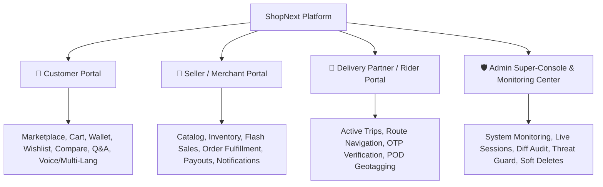

# 🛍️ ShopNext - Hyperlocal Multi-Vendor E-Commerce, Logistics & System Monitoring Platform

ShopNext is an enterprise-grade, high-performance **Hyperlocal Multi-Vendor E-Commerce, Smart Logistics & Enterprise System Monitoring Platform** built with **ASP.NET Core 8.0 MVC**, **Entity Framework Core**, **Microsoft SQL Server**, and modern **Dark Glassmorphic UI aesthetics**.

The platform seamlessly connects neighborhood merchants (Grocery, Electronics, Bakery, Organic produce, Fashion) with local customers and delivery riders for ultra-fast doorstep delivery, backed by an automated Targeted Multi-Role Notification Engine, sub-10ms AJAX Dynamic Lazy-Loading Dashboards, and a bank-grade Admin System Monitoring and Audit Command Center.

---

## 🔔 Targeted Multi-Role Notification System (`INotificationService`)
ShopNext features an intelligent **Role & Recipient Targeted Notification Engine** that automatically routes live alerts to the exact intended recipient:
- 👤 **Customer Alerts (`CustomerId`)**: Instant notifications for order placement, 4-digit handover delivery OTP, status transitions (Packed, Shipped, Out for Delivery, Delivered), return updates, and wallet cashbacks.
- 🏪 **Seller / Merchant Alerts (`ShopId`)**: High-priority notifications for new incoming orders with order value ₹, inventory low-stock warnings (Threshold < 5 units), customer returns/cancellations, and KYC verification approvals.
- 🛵 **Delivery Partner Alerts (`RiderId`)**: Instant pickup notifications when orders are packed at merchant stores, doorstep delivery assignments, and route optimization updates.
- 🛡️ **Admin / Super-Console Alerts (`Admin`)**: Platform-wide transaction anomalies, merchant KYC onboarding requests, high-risk customer alerts, and system security warnings.
- ⚡ **Features**:
  - **Live Dynamic Badges**: Instant unread counter on navigation bars and sidebar tabs.
  - **One-Click Read Receipts**: Mark all or individual notifications as read via AJAX.
  - **Persisted Database Storage**: Backed by `dbo.Notifications` with dedicated non-clustered indexes (`IX_Notifications_Role_Target`).

---

## ⚡ Ultra-Fast AJAX Dynamic Lazy-Loading Dashboards
Both the **Admin Command Center (25 Tabs)** and **Seller Merchant Portal (17 Tabs)** utilize a high-performance **Dynamic Partial View Lazy-Loading Engine**:
- 🚀 **Initial Page Load in < 15ms**: The primary HTML shell loads only the active overview dashboard and sidebar skeleton, eliminating heavy multi-megabyte DOM trees.
- 🔄 **On-Demand Fetching via AJAX**: Clicking any sidebar menu tab fetches its pre-compiled Razor partial view (`/Vendor/GetTabPartial?tab=xyz` or `/Admin/GetTabPartial?tab=xyz`) in < 10ms.
- 💾 **Client-Side View Caching**: Once loaded, tab views are cached in the local DOM (`data-loaded="true"`), making subsequent switches instantaneous (0ms transition).
- 📊 **Dynamic Script & Chart Re-binding**: Charts, data tables, and interactive action buttons automatically re-initialize upon injection.

---

## 🛡️ Enterprise System Monitoring & Audit Center (Point 174)
ShopNext includes a dedicated **Super-Admin System Monitoring Command Center** accessible at `/Admin/SystemMonitoring`:
- 👥 **Live Session Telemetry**: Real-time tracking of Active, Online, Offline, and Idle user sessions with device, IP, and browser detection.
- ⚡ **Force Session Termination**: Super-Admin can remotely terminate compromised or rogue user sessions with 1-click (`/Admin/ForceLogout`).
- 📝 **Diff Change Tracking (Audit)**: Tracks before vs after JSON values (`OldValues` vs `NewValues`) on every entity update across all tables.
- 🗑️ **Soft Delete & 1-Click Restore**: Full Recycle Bin architecture ensuring zero accidental data loss with instant rollback (`/Admin/RestoreDeletedRecord`).
- 👁️ **Seen / Unseen Notification Tracking**: Read receipts and live badge counters for alerts, orders, and customer queries.
- 🚨 **Automated Threat Detection**: Real-time security alerts for brute force logins, suspicious IP hopping, and high-velocity order fraud.
- 📊 **Audit Log CSV Export**: One-click streaming download of complete audit logs for compliance (`/Admin/ExportAuditLogsCsv`).

---

## 🎨 Universal High-Contrast UI Suite & Dark Portal Canvas
ShopNext features a bank-grade **Dual-Mode Visual Design System** ensuring zero eye strain, 100% sharp contrast, and stunning modern aesthetics:
- 🌌 **Seamless Dark Portal (`theme-dark-portal`)**: Merchant, Rider, and Admin workspaces run on a cohesive deep navy/slate canvas (`#090d16` to `#1e293b`), eliminating stark white background cut-offs.
- 🔤 **High-Contrast Typography**: Ultra-crisp off-white headings (`#ffffff`) and bright silver-grey subtext (`#cbd5e1`) across all cards, sidebars, tables, and metric widgets.
- 💡 **Vibrant Accent Glyphs**: Tailored iconography in luminous Royal Blue (`#60a5fa`), Emerald Green (`#34d399`), Amber Yellow (`#fbbf24`), and Coral Red (`#f87171`).
- 🧹 **Clean Interactive Empty States**: Dynamic catalog and order history views automatically render action-oriented empty cards with 1-click creation shortcuts instead of confusing dummy data.

---

## 📍 Live GPS Auto-Detection & Interactive Map Pin-Picker (Leaflet.js)
- 🛰️ **One-Click Geolocation**: Free browser GPS auto-detects latitude/longitude and resolves full street address, landmark, city, and pincode via OpenStreetMap Nominatim reverse geocoding.
- 🗺️ **Draggable Map Pin**: Interactive Leaflet.js map lets customers and riders fine-tune precise doorstep delivery pins with real-time coordinate synchronization in `Cart.cshtml` and `Profile.cshtml`.
- 💰 **Zero API Cost**: 100% free and open-source infrastructure with zero third-party billing dependencies.

---

## 🔒 Multi-Role Isolation & Conflict-Free Session Architecture
- 🛡️ **Strict Claim Priority**: Active navigation bars strictly derive from authenticated `ClaimsPrincipal` (`UserRole`), preventing cross-role navbar leakage (e.g., Riders viewing Admin links).
- 🧹 **Automatic Cross-Role Purge**: Logging into any role (Customer, Seller, Rider, Admin) instantly wipes stale legacy session cookies (`AdminAuth`, `ShopId`, `RiderId`, `CustomerId`) to guarantee zero 403 Forbidden permission barriers.
- 👥 **High-Concurrency Multi-Login**: Unique GUID `SessionId` claims isolate individual concurrent browser sessions without state collision.

---

## 🌐 Point 173: Multi-Language & Localization System
ShopNext includes a native **Multi-Language & Localization Engine** supporting 10 Indian & international languages:
- 🇬🇧 **English (`en`)** (Default)
- 🇮🇳 **हिन्दी - Hindi (`hi`)**
- 🇮🇳 **Hinglish (`hi-Latn`)**
- 🇮🇳 **বাংলা - Bengali (`bn`)**
- 🇮🇳 **मराठी - Marathi (`mr`)**
- 🇮🇳 **தமிழ் - Tamil (`ta`)**
- 🇮🇳 **తెలుగు - Telugu (`te`)**
- 🇮🇳 **ગુજરાતી - Gujarati (`gu`)**
- 🇮🇳 **ಕನ್ನಡ - Kannada (`kn`)**
- 🇮🇳 **ਪੰਜਾਬੀ - Punjabi (`pa`)**

### ⚡ Localization Highlights:
1. **Header Dropdown**: Instant language switcher with native scripts and regional flags.
2. **Instant DOM Translation**: Dynamic client-side dictionary replacement without reloading the page.
3. **Persistent Culture**: Synchronized across cookies (`ShopNext_Language`), `localStorage`, and server-side responses.
4. **Server-Side ILocalizationService**: Localized flash messages, error codes, tax invoices, and notifications.

---

## 🚀 Key Technologies & Stack

| Layer | Technology |
| :--- | :--- |
| **Framework** | ASP.NET Core 8.0 MVC (C#) |
| **Database** | Microsoft SQL Server (`localhost\SQLEXPRESS` / LocalDB) |
| **Performance** | 261 Non-Clustered Indexes, 2 Analytics Views, 13 Stored Procedures |
| **ORM & Data Access** | Entity Framework Core 8.0 + LINQ + Stored Procedures |
| **Styling & Design** | Vanilla CSS3, Bootstrap 5, Dark Glassmorphism, FontAwesome 6 |
| **Notifications** | `INotificationService` Targeted Multi-Role Push & DB Storage |
| **Localization** | Custom Dual-Engine Localization (`ILocalizationService` + `localization.js`) |
| **Maps & Geolocation** | Leaflet.js (OpenStreetMap) Live GPS Tracking |
| **Security** | Claims-Based Cookie Authentication, Antiforgery Tokens, SHA256 Hashing |

---

## 👥 Platform Portals & Architecture



### 1. 🛒 Customer Experience Portal
- **Geolocation Discovery**: Proximity-based shop sorting (Haversine formula).
- **Product Comparison**: Side-by-side matrix for 2–4 products (Price, Rating, Specs).
- **Digital Wallet & Gift Cards**: 4-balance ledger (Main, Instant Refund, Promo, Reward Points).
- **Search Memory & Suggestions**: Auto-recorded queries with one-click cleanup.
- **Payment Failure Recovery**: Non-destructive checkout retry gateway.
- **Smart Recommendations**: *"Customers also bought"*, *"You may also like"*.

### 2. 🏪 Seller / Merchant Hub
- **Shop Onboarding**: KYC verification, address geolocation, document audit.
- **Product Management**: Variants, multi-angle imagery, stock threshold alerts.
- **Flash Sale Participation**: Seller campaign enrollment and price discount controls.
- **Order Dispatch**: Packing slips, barcode tagging, rider auto-assignment.
- **Targeted Notification Feed**: Dynamic real-time alerts for low inventory, new sales, and settlements.

### 3. 🛵 Delivery Partner / Rider Portal
- **Trip Dispatch**: Real-time order dispatch notifications.
- **Turn-by-Turn Navigation**: Map routing from merchant doorstep to customer address.
- **Proof of Delivery (POD)**: Customer delivery OTP verification + latitude/longitude geotagging.
- **Failed Delivery Logging**: 3-attempt failover management with automatic re-scheduling.

### 4. 🛡️ Platform Admin Super-Console & Monitoring Center
- **System Monitoring Command Center**: Live online user counters, session management, telemetry.
- **Entity Diff Tracking**: Visual old-vs-new JSON property differences on record updates.
- **Recycle Bin & Soft Delete Restore**: Reversible data deletion safeguards.
- **AI Customer Risk Score Engine**: Multi-variable behavioral fraud scoring formula.
- **Payment Reconciliation**: Gateway gross vs captured vs refunded net settlement ledger.

---

## 🗄️ Database Architecture: 41 Tables, 261 Indexes, 2 Views & 13 SPs

The database is fully unified and consolidated in `Database/ShopNext_Complete_Schema_And_Stored_Procedures.sql` (and synced at `wwwroot/sql/ShopNext_Complete_DB_Setup.sql`).

### 41 Production Database Tables:
1. `dbo.Users` - Platform accounts (Admin, Customer, Vendor, Rider)
2. `dbo.PasswordResetTokens` - Secure OTP password resets
3. `dbo.Shops` - Merchant stores & geo-coordinates
4. `dbo.Products` - Catalog items & inventory
5. `dbo.Orders` - Transactions & lifecycle tracking
6. `dbo.OrderItems` - Item lines mapped inside orders
7. `dbo.ProductVariants` - SKU sizes, colors, and pricing
8. `dbo.CustomerAddresses` - Delivery addresses with geotags
9. `dbo.Categories` - Product category tree & icons
10. `dbo.Brands` - Brand catalogs & logos
11. `dbo.Coupons` - Discount vouchers & limits
12. `dbo.Offers` - Promotional banners & deals
13. `dbo.Complaints` - 3-party dispute management
14. `dbo.Reviews` - Ratings & verified buyer reviews
15. `dbo.Riders` - Delivery partners & live GPS telemetry
16. `dbo.Notifications` - Role-targeted system alerts & push notices
17. `dbo.Wishlists` - Saved customer items
18. `dbo.AuditLogs` - Who/What/When/Where audit trail
19. `dbo.OrderEvidences` - Unboxing photos & dispatch seals
20. `dbo.LoginHistories` - Auth logs with IP, device & browser
21. `dbo.UserSessions` - Active sessions with last-seen heartbeat
22. `dbo.UserActivities` - Granular user actions & audit telemetry
23. `dbo.EntityChangeLogs` - Before vs After JSON diff tracking
24. `dbo.SoftDeleteLogs` - Recycle Bin with 1-click restore metadata
25. `dbo.EntityViewLogs` - Seen/Unseen read receipt tracking
26. `dbo.SecurityThreatAlerts` - Automated fraud & brute force alerts
27. `dbo.SearchHistories` - Keyword search logs & suggestions
28. `dbo.ProductQuestions` - Pre-purchase Q&A inquiries
29. `dbo.ProductAnswers` - Verified answers from sellers/admin
30. `dbo.ChatMessages` - Live customer-vendor chat
31. `dbo.PriceDropAlerts` - Target price drop notifications
32. `dbo.StockAlerts` - Back-in-stock auto notifications
33. `dbo.WalletAccounts` - Customer digital wallet balances
34. `dbo.WalletTransactions` - Wallet credit/debit audit ledger
35. `dbo.GiftCards` - Digital gift vouchers & pins
36. `dbo.RewardPoints` - Loyalty rewards balance
37. `dbo.RewardPointsTransactions` - Loyalty accrual & redemption log
38. `dbo.StockReservations` - Concurrency stock hold locks
39. `dbo.PincodeServiceabilities` - Delivery serviceable zones & ETAs
40. `dbo.FailedDeliveryLogs` - 3-strike delivery failover logs
41. `dbo.DeliveryProofs` - Geotagged POD with handover OTPs

### 2 High-Performance Analytics Views:
1. `dbo.vw_SellerInventoryHealth`: Pre-computed real-time inventory aggregation (Total SKU counts, Low Stock alerts, Out of Stock, Total Stock Units, Inventory Valuation).
2. `dbo.vw_CustomerRiskProfiles`: Pre-computed customer behavioral risk scores, return frequencies, cancellation rates, and COD restrictions.

### 13 Optimized Stored Procedures:
- `sp_GetAdminDashboardMetrics`: Aggregates top-level GMV, total orders, active customer/seller counts, and open alerts in a single query.
- `sp_GetCustomerRiskProfile`: Fetches live risk score calculations with order failure metrics.
- `sp_GetSellerInventoryHealth`: Instant health metrics for any given merchant `ShopId`.
- `sp_ReserveProductStock`: High-concurrency thread-safe inventory slot reservation with TTL.
- `sp_ReleaseExpiredStockReservations`: Batch-cleanup cron for expired reservations.
- `sp_ReconcilePayments`: Automated 3-way financial gateway vs captured vs order reconciliation.
- `sp_GetNearbyAvailableRiders`: Fast geospatial Haversine query to locate nearest online delivery partners.
- `sp_GetSellerDashboardMetrics`: Aggregates total sales, active products, pending orders, and payout balances.
- `sp_GetCategoryProductCounts`: Pre-aggregates catalog counts across all active categories.
- `sp_GetRecentAuditLogs`: Paged audit query with before/after diff metadata.
- `sp_GetActiveUserSessions`: Live telemetry for active user sessions.
- `sp_SoftDeleteEntity`: Standardized soft-deletion with automatic recycle bin logging.
- `sp_RestoreSoftDeletedEntity`: One-click atomic restoration of soft-deleted records.

---

## 📁 Repository Structure

```
ShopNext/
│
├── Controllers/
│   ├── HomeController.cs           # Marketplace, Compare, Invoice, Language Switcher, Cart
│   ├── CustomerController.cs       # Account, Orders, Digital Wallet, Retry Payment, Returns
│   ├── VendorController.cs         # Merchant Portal (17 Lazy Tabs), Catalog, Order Fulfillment
│   ├── RiderController.cs          # Delivery Dashboard, GPS Telemetry, OTP Verification
│   ├── AdminController.cs          # Command Center (25 Lazy Tabs), System Monitoring, Audit
│   ├── AccountController.cs        # Auth, Session Tracking, Login/Logout Telemetry
│   └── DatabaseSetupController.cs  # SQL Schema Hub & Master Script Sync
│
├── Models/
│   ├── User.cs                     # Identity & Role Management
│   ├── Shop.cs                     # Merchant Stores & Geolocation
│   ├── Product.cs                  # Catalog Items & Stock
│   ├── Order.cs                    # Orders, Payments & Return Status
│   ├── Notification.cs             # Role & Recipient-Targeted Notifications
│   ├── AdvancedFeaturesModels.cs   # Comparison, Wallet, Q&A, Alerts, Reconciliation, POD
│   ├── SystemMonitoringModels.cs   # Sessions, User Activities, Diffs, Soft Deletes, Threats
│   └── ShopNextDbContext.cs        # Relational Database Context with EF Core mappings
│
├── Services/
│   ├── INotificationService.cs     # Targeted Multi-Role Notification Interface
│   ├── NotificationService.cs      # Targeted Notification Dispatch & Mark-As-Read Engine
│   ├── ILocalizationService.cs     # Multi-Language Localization Interface
│   ├── LocalizationService.cs      # 10-Language Dictionary Translation Provider
│   ├── ISystemMonitoringService.cs # Session Telemetry & Audit Interface
│   ├── SystemMonitoringService.cs  # Diffs, Soft Delete Restore, Live Monitoring
│   ├── IAdvancedEcommerceService.cs# Points 81-100 Advanced Engines
│   ├── AdvancedEcommerceService.cs # Business Logic Implementation
│   └── IShopNextService.cs         # Core E-Commerce Services
│
├── Views/
│   ├── Home/                       # Index, Marketplace, Compare, Cart, Invoice
│   ├── Customer/                   # Account, Wallet, RetryPayment, MyOrders
│   ├── Vendor/                     # Products, Orders, Store Settings + 17 Lazy Partial Views
│   │   └── Partials/               # _AllProductsTab, _NewOrdersTab, _NotificationsTab, etc.
│   ├── Rider/                      # Delivery Trips, GPS Navigation
│   ├── Admin/                      # Master Control Panel + 25 Lazy Partial Views
│   │   └── Partials/               # _UsersTab, _CatalogTab, _RiskDashboardTab, etc.
│   └── Shared/_Layout.cshtml       # Header, Multi-Lang Switcher, Global Footer
│
├── Database/
│   └── ShopNext_Complete_Schema_And_Stored_Procedures.sql # Master DB SQL Script
│
└── wwwroot/
    ├── js/localization.js          # Client-Side Dynamic Translation Engine
    ├── js/site.js                  # Cart & AJAX Helpers
    ├── css/site.css                # Dark Glassmorphism Styling
    └── sql/ShopNext_Complete_DB_Setup.sql # Synced DB SQL Script
```

---

## ⚡ Quick Start & Running Locally

### Prerequisites
- [.NET 8.0 SDK](https://dotnet.microsoft.com/download/dotnet/8.0)
- SQL Server (LocalDB, Express, or Developer Edition)
- Visual Studio 2022 or VS Code

### Installation Steps

1. **Clone the repository**:
   ```bash
   git clone https://github.com/pra2011shant/ShopNext.git
   cd ShopNext/ShopNext
   ```

2. **Configure Database Connection**:
   Update `appsettings.json` with your SQL Server connection string:
   ```json
   "ConnectionStrings": {
     "DefaultConnection": "Server=localhost\\SQLEXPRESS;Database=ShopNext;Trusted_Connection=True;MultipleActiveResultSets=true;TrustServerCertificate=True"
   }
   ```

3. **Deploy the Database**:
   Execute the master SQL script `Database/ShopNext_Complete_Schema_And_Stored_Procedures.sql` in SQL Server Management Studio (SSMS) or Azure Data Studio to create all 41 tables, 261 indexes, 2 views, 13 stored procedures, and seed data.

4. **Build and Run**:
   ```bash
   dotnet build
   dotnet run
   ```

5. **Access the Application**:
   Open your browser at `http://localhost:5200` or `https://localhost:7147`.
   - Admin System Monitoring Center: `http://localhost:5200/Admin/SystemMonitoring`
   - Customer Marketplace: `http://localhost:5200`
   - Merchant Portal: `http://localhost:5200/Vendor/Login`
   - Rider Portal: `http://localhost:5200/Rider/Login`

---

## 📖 Detailed Workflows
For visual flowcharts of Order Lifecycles, Targeted Notification Dispatch, Dynamic AJAX Lazy Loading, Return Workflows, Localization Engines, AI Risk Calculations, and System Monitoring Architecture, refer to **[WORKFLOW.md](WORKFLOW.md)**.

