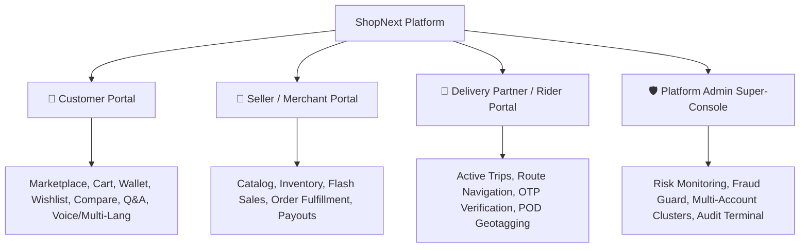

# 🛍️ ShopNext - Hyperlocal Multi-Vendor E-Commerce & Logistics Platform

ShopNext is an enterprise-grade, high-performance **Hyperlocal Multi-Vendor E-Commerce & Smart Logistics Platform** built with **ASP.NET Core 8.0 MVC**, **Entity Framework Core**, **SQL Server**, and modern **Dark Glassmorphic UI aesthetics**.

The platform seamlessly connects neighborhood merchants (Grocery, Electronics, Bakery, Organic produce, Fashion) with local customers and delivery riders for ultra-fast, minutes-away doorstep delivery.

---

## 🌐 Point 173: Multi-Language & Localization System
ShopNext includes a native **Multi-Language & Localization Engine** supporting 10 Indian & international languages:
- 🇬🇧 **English (`en`)** (Default)
- 🇮🇳 **हिन्दी - Hindi (`hi`)**
- 🇮🇳 **Hinglish (`hi-Latn`)**
- 🇮🇳 **বাংলা - Bengali (`bn`)**
- 🇮🇳 **मराठी - Marathi (`mr`)**
- 🇮🇳 **தமிழ் - Tamil (`ta`)**
- 🇮🇳 **తెలుగు - Telugu (`te`)**
- 🇮🇳 **ગુજરાતી - Gujarati (`gu`)**
- 🇮🇳 **ಕನ್ನಡ - Kannada (`kn`)**
- 🇮🇳 **ਪੰਜਾਬੀ - Punjabi (`pa`)**

### ⚡ Localization Highlights:
1. **Header Dropdown**: Instant language switcher with native scripts and regional flags.
2. **Instant DOM Translation**: Dynamic client-side dictionary replacement without reloading the page.
3. **Persistent Culture**: Synchronized across cookies (`ShopNext_Language`), `localStorage`, and server-side responses.
4. **Server-Side ILocalizationService**: Localized flash messages, error codes, tax invoices, and notifications.

---

## 🚀 Key Technologies & Stack

| Layer | Technology |
| :--- | :--- |
| **Framework** | ASP.NET Core 8.0 MVC (C#) |
| **Database** | Microsoft SQL Server (`localhost\SQLEXPRESS` / LocalDB) |
| **ORM & Data Access** | Entity Framework Core 8.0 + LINQ + Stored Procedures |
| **Styling & Design** | Vanilla CSS3, Bootstrap 5, Dark Glassmorphism, FontAwesome 6 |
| **Localization** | Custom Dual-Engine Localization (`ILocalizationService` + `localization.js`) |
| **Maps & Geolocation** | Leaflet.js (OpenStreetMap) Live GPS Tracking |
| **Security** | Claims-Based Cookie Authentication, Antiforgery Tokens, SHA256 Hashing |

---

## 👥 Platform User Portals & Roles



### 1. 🛒 Customer Experience Portal
- **Geolocation Discovery**: Proximity-based shop sorting (Haversine formula).
- **Product Comparison**: Side-by-side matrix for 2–4 products (Price, Rating, Specs).
- **Digital Wallet & Gift Cards**: 4-balance ledger (Main, Instant Refund, Promo, Reward Points).
- **Search Memory & Suggestions**: Auto-recorded queries with one-click cleanup.
- **Payment Failure Recovery**: Non-destructive checkout retry gateway.
- **Smart Recommendations**: *"Customers also bought"*, *"You may also like"*.

### 2. 🏪 Seller / Merchant Hub
- **Shop Onboarding**: KYC verification, address geolocation, document audit.
- **Product Management**: Variants, multi-angle imagery, stock threshold alerts.
- **Flash Sale Participation**: Seller campaign enrollment and price discount controls.
- **Order Dispatch**: Packing slips, barcode tagging, rider auto-assignment.

### 3. 🛵 Delivery Partner / Rider Portal
- **Trip Dispatch**: Real-time order dispatch notifications.
- **Turn-by-Turn Navigation**: Map routing from merchant doorstep to customer address.
- **Proof of Delivery (POD)**: Customer delivery OTP verification + latitude/longitude geotagging.
- **Failed Delivery Logging**: 3-attempt failover management with automatic re-scheduling.

### 4. 🛡️ Platform Admin Super-Console
- **Smart Risk Dashboard**: Real-time telemetry for high-return customers, COD abuse, and dispute clusters.
- **Complete Admin Action Audit Log**: Terminal recording *Who $\rightarrow$ What $\rightarrow$ When $\rightarrow$ Where*.
- **AI Customer Risk Score Engine**: Multi-variable behavioral fraud scoring formula.
- **Payment Reconciliation**: Gateway gross vs captured vs refunded net settlement ledger.

---

## 📁 Repository Structure

```
ShopNext/
│
├── Controllers/
│   ├── HomeController.cs           # Marketplace, Compare, Invoice, Language Switcher, Cart
│   ├── CustomerController.cs       # Account, Orders, Digital Wallet, Retry Payment, Returns
│   ├── VendorController.cs         # Merchant Portal, Product Catalog, Order Fulfillment
│   ├── RiderController.cs          # Delivery Dashboard, GPS Telemetry, OTP Verification
│   ├── AdminController.cs          # Audit Logs, Reconciliation, Risk Guard, Approvals
│   └── DatabaseSetupController.cs  # SQL Schema Hub & Seed Console
│
├── Models/
│   ├── User.cs                     # Identity & Role Management
│   ├── Shop.cs                     # Merchant Stores & Geolocation
│   ├── Product.cs                  # Catalog Items & Stock
│   ├── Order.cs                    # Orders, Payments & Return Status
│   ├── AdvancedFeaturesModels.cs   # Comparison, Wallet, Q&A, Alerts, Reconciliation, POD
│   └── ShopNextDbContext.cs        # Relational Database Context
│
├── Services/
│   ├── ILocalizationService.cs     # Multi-Language Localization Interface
│   ├── LocalizationService.cs      # 10-Language Dictionary Translation Provider
│   ├── IAdvancedEcommerceService.cs# Points 81-100 Advanced Engines
│   ├── AdvancedEcommerceService.cs # Business Logic Implementation
│   └── IShopNextService.cs         # Core E-Commerce Services
│
├── Views/
│   ├── Home/                       # Index, Marketplace, Compare, Cart, Invoice
│   ├── Customer/                   # Account, Wallet, RetryPayment, MyOrders
│   ├── Vendor/                     # Products, Orders, Store Settings
│   ├── Rider/                      # Delivery Trips, GPS Navigation
│   ├── Admin/                      # Master Control Panel & Audit Terminal
│   └── Shared/_Layout.cshtml       # Header, Multi-Lang Switcher, Global Footer
│
└── wwwroot/
    ├── js/localization.js          # Client-Side Dynamic Translation Engine
    ├── js/site.js                  # Cart & AJAX Helpers
    └── css/site.css                # Dark Glassmorphism Styling
```

---

## ⚡ Quick Start & Running Locally

### Prerequisites
- [.NET 8.0 SDK](https://dotnet.microsoft.com/download/dotnet/8.0)
- SQL Server (LocalDB, Express, or Developer Edition)
- Visual Studio 2022 or VS Code

### Installation Steps

1. **Clone the repository**:
   ```bash
   git clone https://github.com/pra2011shant/ShopNext.git
   cd ShopNext/ShopNext
   ```

2. **Configure Database Connection**:
   Update `appsettings.json` with your SQL Server connection string:
   ```json
   "ConnectionStrings": {
     "DefaultConnection": "Server=localhost\\SQLEXPRESS;Database=ShopNext;Trusted_Connection=True;MultipleActiveResultSets=true;TrustServerCertificate=True"
   }
   ```

3. **Build and Run**:
   ```bash
   dotnet build
   dotnet run
   ```

4. **Access the Application**:
   Open browser at `http://localhost:5000` or `https://localhost:5001`.

---

## 📖 Detailed Workflows
For visual flowcharts of Order Lifecycles, Return Workflows, Localization Engines, and AI Risk Calculations, refer to **[WORKFLOW.md](WORKFLOW.md)**.
