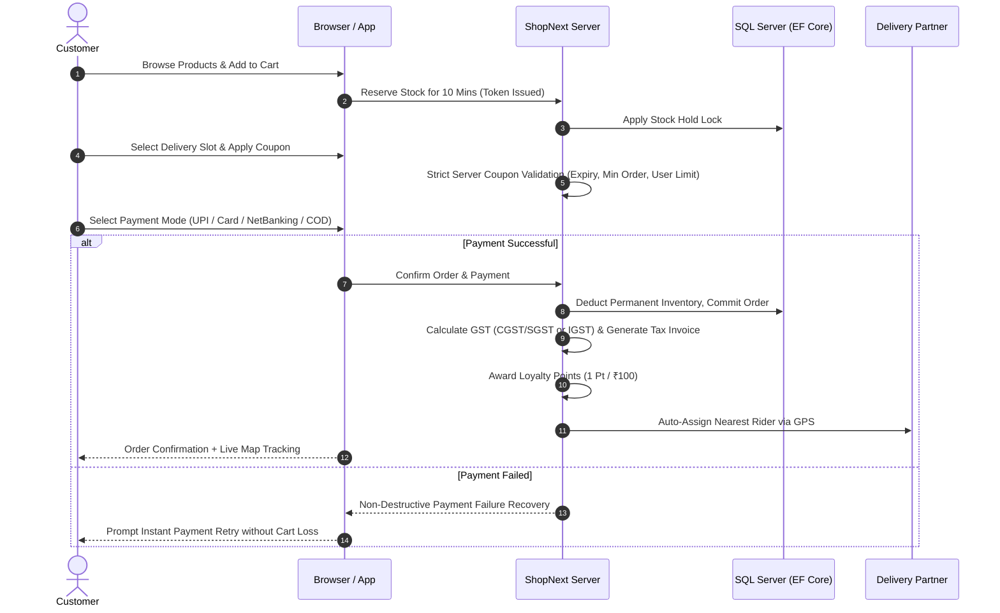
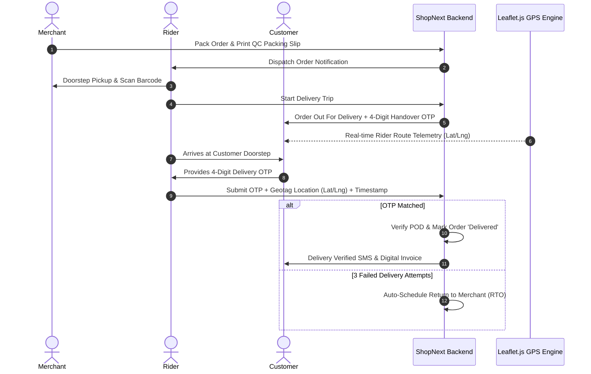
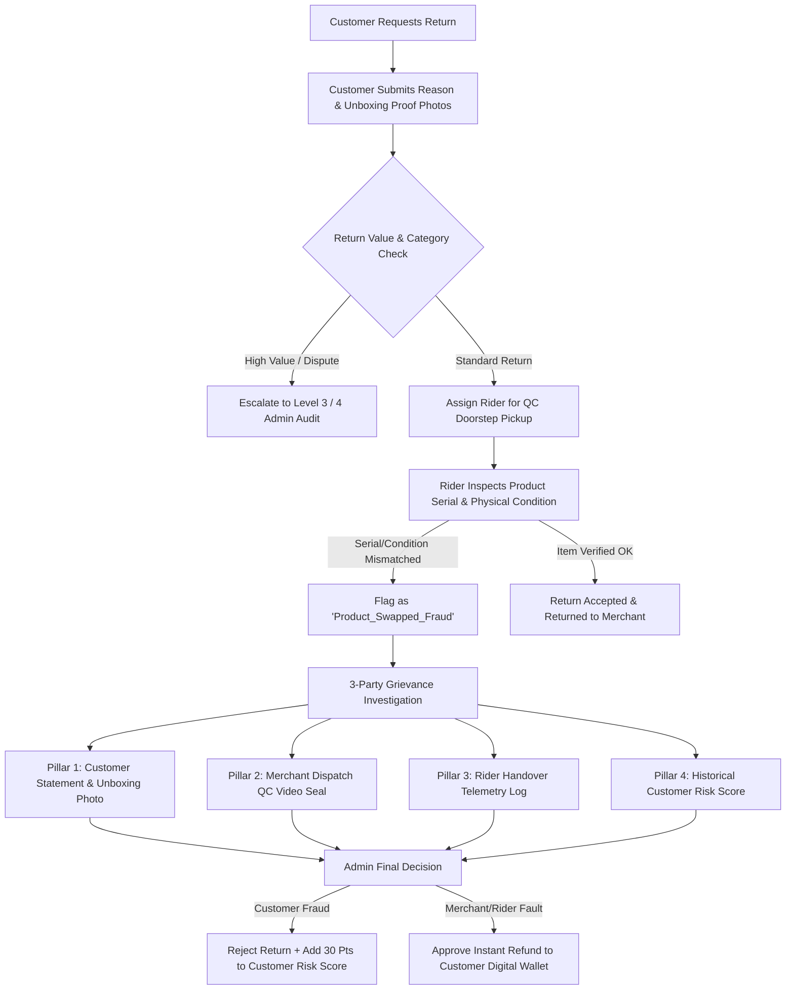
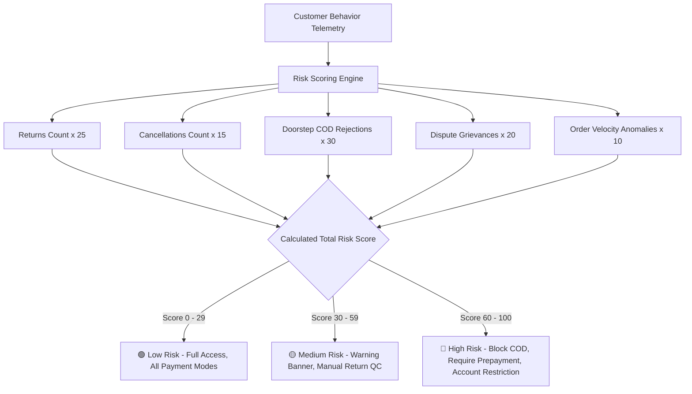
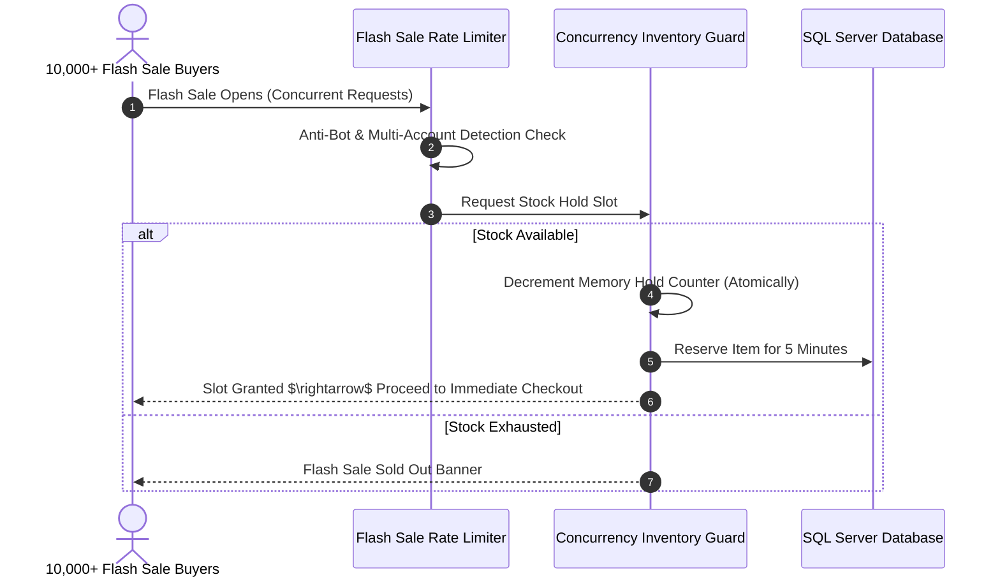

# 🔄 ShopNext - Core Workflows & Architecture Guide

This document illustrates the complete end-to-end architectural workflows of the ShopNext platform using Mermaid visual diagrams.

---

## 1. 🛒 Customer Shopping & Order Lifecycle



---

## 2. 🌐 Point 173: Multi-Language & Localization Architecture

```mermaid
graph TD
    A[User Selects Language in Navbar Dropdown] --> B{Storage Strategy}
    B -->|Cookie| C1[Cookie: ShopNext_Language]
    B -->|Local Storage| C2[localStorage: shopnext_selected_language]
    B -->|Async POST| C3[/Home/SetLanguageJson]

    C1 & C2 & C3 --> D[Client-Side Localization Engine: localization.js]
    D --> E1[Translate data-i18n Elements]
    D --> E2[Translate Search Placeholders data-i18n-placeholder]
    D --> E3[Update Active Flag & Language Badge]

    E1 & E2 --> F[MutationObserver Watcher]
    F -->|Detects dynamic AJAX HTML| G[Auto-Translates Modals, Cart & Product Cards]

    C1 --> H[Server-Side ILocalizationService]
    H --> I1[Server Rendered Razor Views]
    H --> I2[Localized Controller Validation Errors]
    H --> I3[Localized Tax Invoices & SMS/Email Alerts]
```

---

## 3. 🚚 Hyperlocal Dispatch & Proof of Delivery (POD)



---

## 4. 🛡️ Return, Swap Fraud Prevention & 3-Party Grievance



---

## 5. 🧠 AI Customer Risk Score & Fraud Monitoring Engine



---

## 6. ⚡ High-Concurrency Flash Sale & Zero-Oversell Protection


