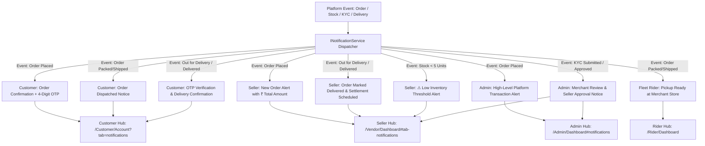
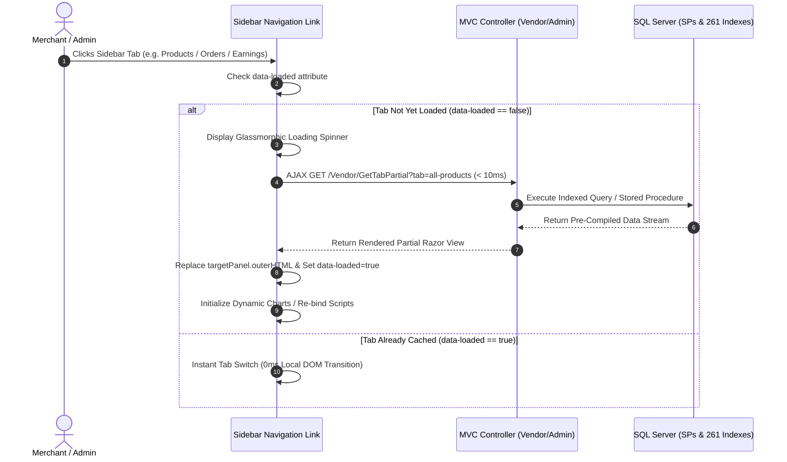
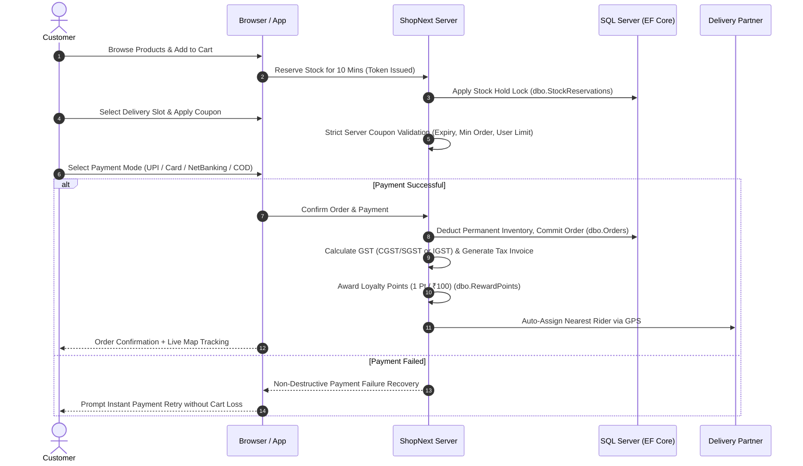
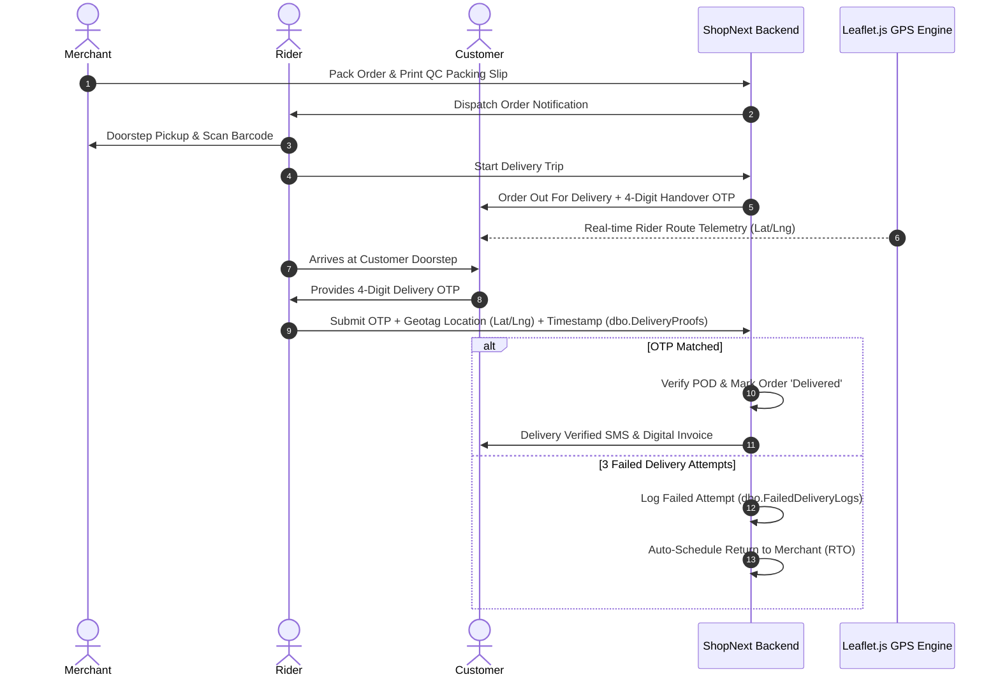
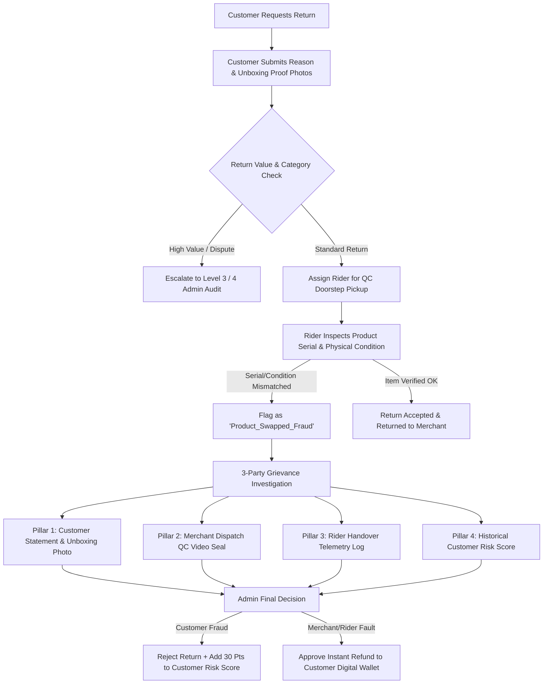
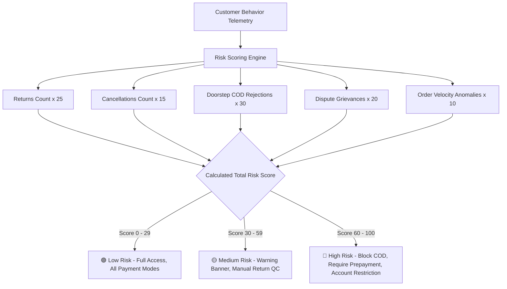
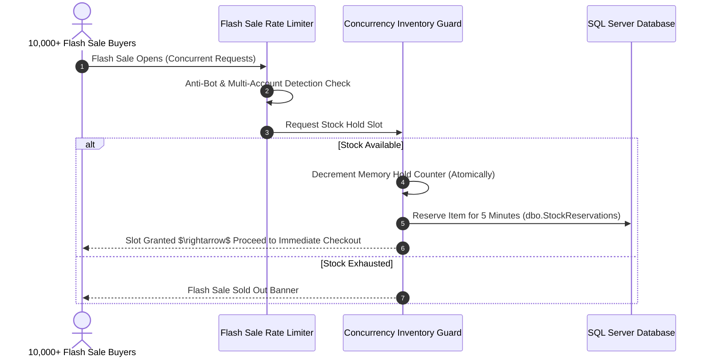
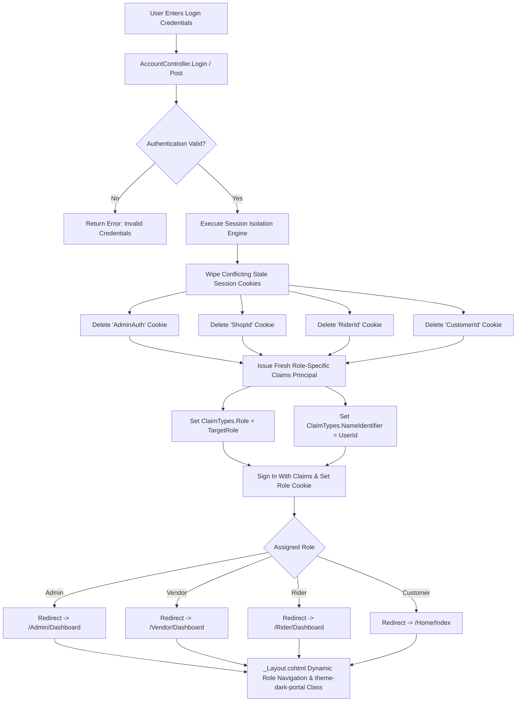
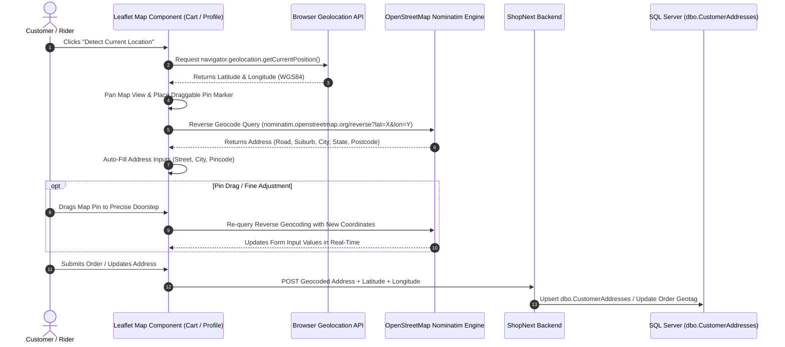
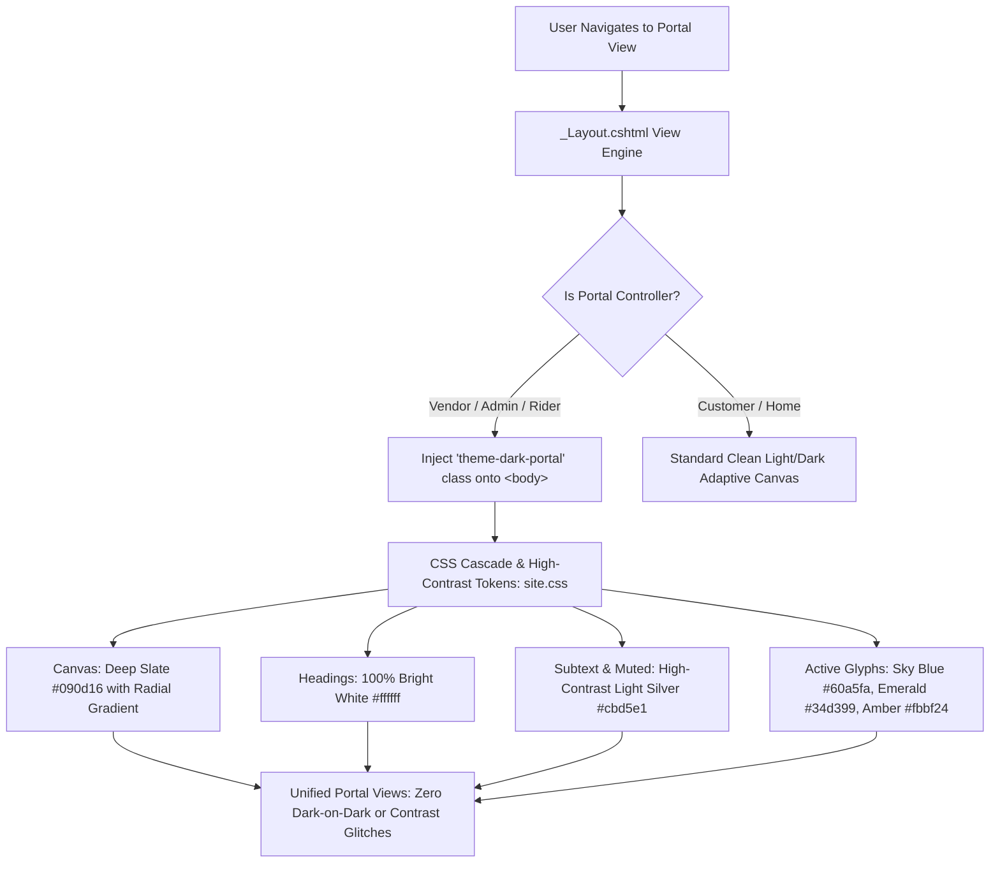

# 🔄 ShopNext - Core Workflows & Architecture Guide

This document illustrates the complete end-to-end architectural workflows of the ShopNext platform using Mermaid visual diagrams.

---

## 1. 🔔 Targeted Multi-Role Notification Dispatch Architecture



---

## 2. ⚡ Ultra-Fast AJAX Dynamic Lazy-Loading Workflow



---

## 3. 🛒 Customer Shopping & Order Lifecycle



---

## 4. 🛡️ System Monitoring, Live Sessions & Diff Audit Lifecycle (Point 174)

```mermaid
graph TD
    A[User Action: Login / Browse / Edit / Delete] --> B[HTTP Request + Cookie Auth Token]
    
    B --> C{Action Type}
    
    C -->|Authentication| D[AccountController / Login / Logout]
    D --> D1[Record dbo.LoginHistories: IP, Device, Browser, Status]
    D --> D2[Upsert dbo.UserSessions: Token, IsActive=1, Heartbeat]
    
    C -->|Normal Activity / API| E[ISystemMonitoringService: LogActivityAsync]
    E --> E1[Record dbo.UserActivities: Controller, Action, Method, Payload]
    E --> E2[Update UserSession: LastSeenTime = GETDATE()]

    C -->|Record Update| F[Entity Update Interceptor]
    F --> F1[Compute JSON Diff: OldValues vs NewValues]
    F --> F2[Save to dbo.EntityChangeLogs: EntityName, RecordId, ChangedBy, JSON Diff]

    C -->|Record Delete| G[Soft Delete Engine]
    G --> G1[Set Target Entity: IsDeleted = 1]
    G --> G2[Save to dbo.SoftDeleteLogs: EntityName, RecordId, DeletedBy, OriginalJson]

    H[Admin Command Center: /Admin/SystemMonitoring] --> I1[View Real-Time Telemetry Counters]
    H --> I2[Inspect Live User Sessions & 1-Click Force Logout]
    H --> I3[Inspect Entity Diffs with Before vs After Highlighting]
    H --> I4[1-Click Restore Soft-Deleted Records from Recycle Bin]
    H --> I5[Acknowledge Threat Alerts & Export Audit CSV]
```

---

## 5. 🌐 Point 173: Multi-Language & Localization Architecture

```mermaid
graph TD
    A[User Selects Language in Navbar Dropdown] --> B{Storage Strategy}
    B -->|Cookie| C1[Cookie: ShopNext_Language]
    B -->|Local Storage| C2[localStorage: shopnext_selected_language]
    B -->|Async POST| C3[/Home/SetLanguageJson]

    C1 & C2 & C3 --> D[Client-Side Localization Engine: localization.js]
    D --> E1[Translate data-i18n Elements]
    D --> E2[Translate Search Placeholders data-i18n-placeholder]
    D --> E3[Update Active Flag & Language Badge]

    E1 & E2 --> F[MutationObserver Watcher]
    F -->|Detects dynamic AJAX HTML| G[Auto-Translates Modals, Cart & Product Cards]

    C1 --> H[Server-Side ILocalizationService]
    H --> I1[Server Rendered Razor Views]
    H --> I2[Localized Controller Validation Errors]
    H --> I3[Localized Tax Invoices & SMS/Email Alerts]
```

---

## 6. 🚚 Hyperlocal Dispatch & Proof of Delivery (POD)



---

## 7. 🛡️ Return, Swap Fraud Prevention & 3-Party Grievance



---

## 8. 🧠 AI Customer Risk Score & Fraud Monitoring Engine



---

## 9. ⚡ High-Concurrency Flash Sale & Zero-Oversell Protection



---

## 10. 🔒 Multi-Role Session Isolation & Cross-Role Cookie Purge



---

## 11. 📍 Live GPS Auto-Detection & Interactive Map Pin-Picker (Leaflet.js)



---

## 12. 🎨 Universal High-Contrast Dark Portal UI Flow



