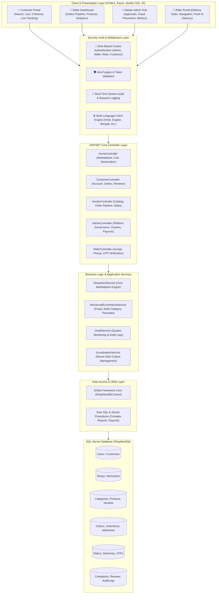
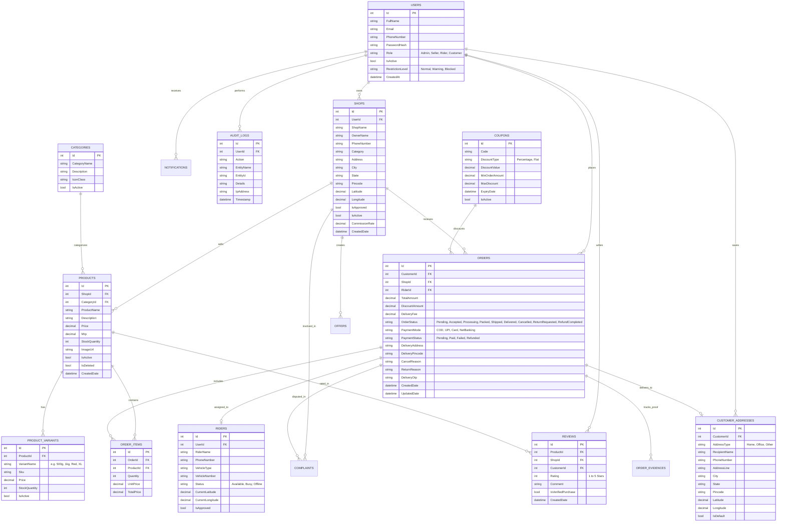
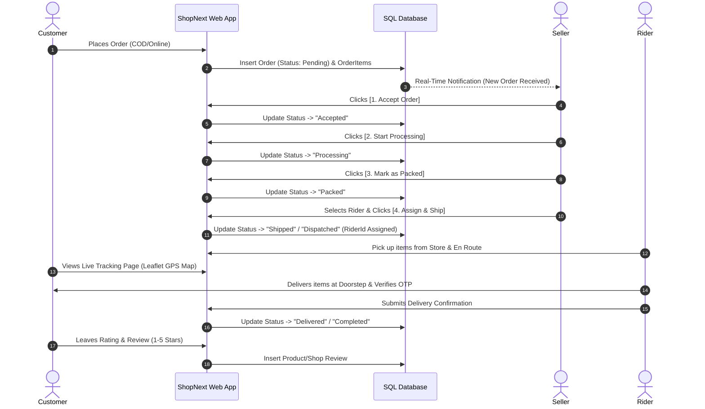

# 🏗️ ShopNext - Complete System Design & Database Architecture

## 📌 Executive Summary
**ShopNext** is an enterprise-grade Hyperlocal E-Commerce & Multi-Vendor Marketplace built with **ASP.NET Core (.NET 8/9)**, **Entity Framework Core**, and **Microsoft SQL Server**. It connects local neighborhood brick-and-mortar merchants with nearby customers for fast same-day deliveries, live GPS order tracking, intelligent rider dispatch, automated return/refund management, and platform governance.

---

## 🏛️ 1. High-Level System Architecture

---

## 🗄️ 2. Complete Entity-Relationship (ER) Database Diagram

---

## 📋 3. Database Schema & Tables Specification

### 3.1. Core Identity & Access Tables
1. **`Users`**: Central account table storing user credentials, hashed passwords, contact details, multi-role claims (`Customer`, `Seller`, `Rider`, `Admin`), suspension status, and risk flags.
2. **`PasswordResetTokens`**: Secure time-bound cryptographic tokens for self-service password recovery.
3. **`CustomerAddresses`**: Multiple saved shipping destinations for 1-click checkout with GPS coordinates (`Latitude`, `Longitude`).

### 3.2. Merchant & Catalog Tables
1. **`Shops`**: Merchant storefronts with geocoding (`Latitude`, `Longitude`), business categories, tax/GST compliance, approval state, and bank account settlement info.
2. **`Categories`**: Hierarchy classification (Grocery, Electronics, Dairy, Fruits & Vegetables, Bakery, Fashion, etc.).
3. **`Products`**: Multi-merchant catalog items with MRP, Selling Price, dynamic inventory stock, and image galleries.
4. **`ProductVariants`**: Specific item sizes, weights, and color configurations (e.g., 500g, 1kg, 5L, Size L).

### 3.3. Order Processing & Transaction Tables
1. **`Orders`**: Master transaction table tracking order financial breakdown, payment modes (COD, UPI, Card), delivery address, order status lifecycle, and OTPs.
2. **`OrderItems`**: Line items for each order preserving snapshot unit prices and quantities at purchase time.
3. **`Coupons`**: Promotional campaign discount codes with validity windows, minimum purchase thresholds, and max discount caps.
4. **`Offers`**: Flash sales and "Today's Deals" with discounted prices and real-time countdown timers.

### 3.4. Logistics & Fulfillment Tables
1. **`Riders`**: Hyperlocal delivery partners with live vehicle info, availability state, and live GPS coordinates.
2. **`OrderEvidences`**: Delivery confirmation photo proof, signature uploads, and delivery dispute resolution records.

### 3.5. Quality, Governance & Security Tables
1. **`Reviews`**: Customer ratings (1-5 stars) and feedback for products and shops.
2. **`Complaints`**: Order disputes, item damaged claims, and seller/customer dispute tracking.
3. **`Notifications`**: Real-time customer, merchant, and rider order alerts and system announcements.
4. **`AuditLogs`**: Platform-wide immutable audit trail of administrative actions, payouts, status updates, and security events.

---

## 🔄 4. Core Workflows & Data Pipelines

### 4.1. Order Lifecycle Pipeline (Feature 25)

---

### 4.2. GPS Proximity & Distance Calculation (Haversine Algorithm)
When a customer browses approved shops:
$$\text{Distance} = 2 R \cdot \arcsin\left(\sqrt{\sin^2\left(\frac{\Delta\text{lat}}{2}\right) + \cos(\text{lat}_1)\cos(\text{lat}_2)\sin^2\left(\frac{\Delta\text{lon}}{2}\right)}\right)$$
- `R = 6371 km` (Earth's mean radius)
- Verified approved shops are dynamically queried from `Shops`, ordered by shortest distance to customer's detected GPS pin, and rendered on interactive maps.

---

## 🛡️ 5. Security & Data Integrity Guarantees
1. **Password Security**: Cryptographic hashing (PBKDF2 / SHA-256 with salts).
2. **SQL Injection Prevention**: 100% Parameterized EF Core queries & Dapper Stored Procedures.
3. **XSS & CSRF Protection**: Encoded Razor output and token verification.
4. **Role Isolation**: Strict Controller-level authorization policies (`[Authorize(Roles = "...")]`).
5. **Multi-Language Architecture**: 0-delay client DOM translation engine with server cookie synchronization.
