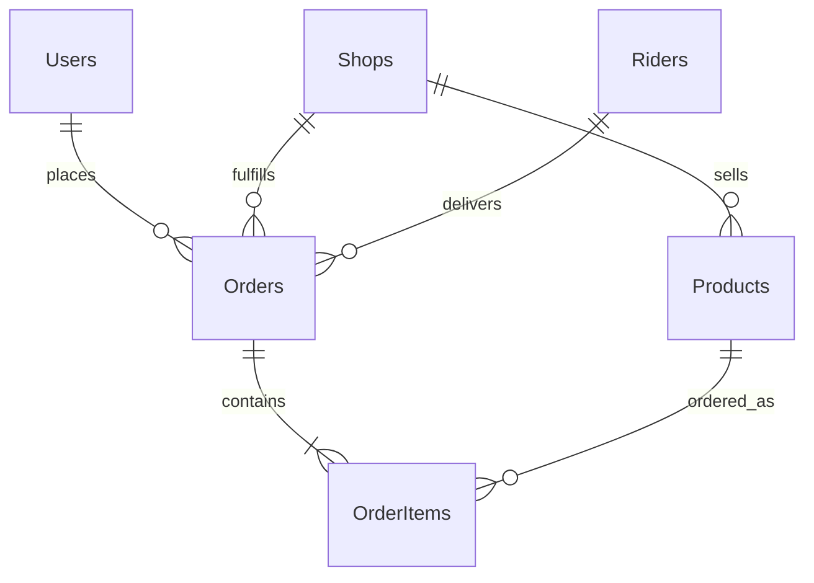
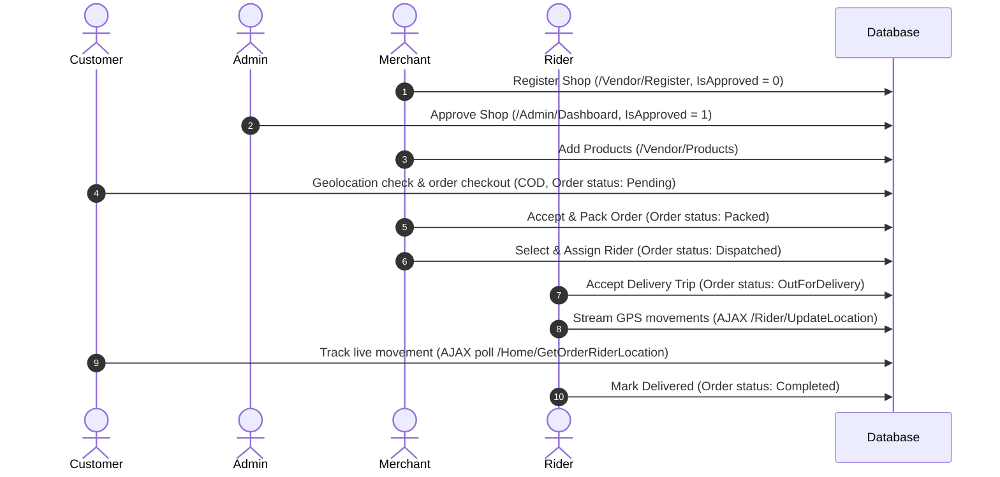

# ShopNext - E-Commerce Handover & Onboarding Guide (Hindi)

**ShopNext** handover guide me aapka swagat hai. Is document me application ki architecture, database schema, code execution pipelines, aur user workflows ke baare me bataya gaya hai. Yeh guide developers, administrators, ya kisi bhi naye team member ke onboarding ke liye ek clear aur simple reference ki tarah kaam karega.

---

## 🚀 1. Tech Stack & Key Technologies (Tekniki Dhaancha)

- **Backend Framework**: ASP.NET Core MVC (Targeting `.NET 8.0`)
- **Database Access (ORM)**: EF Core (Entity Framework Core) configured with raw SQL query mappings (`FromSqlRaw` aur `ExecuteSqlRawAsync`) for maximum query speed aur minimum database overhead.
- **Database Engine**: MS SQL Server LocalDB (`(localdb)\MSSQLLocalDB` instance).
- **CSS Framework**: **Bootstrap 5** responsive aur fluid layouts ke liye jo desktop, tablet aur mobile screen ke hisab se responsive hai.
- **JavaScript & AJAX**: **jQuery** asynchronous HTTP communication handle karta hai taaki database operations ya status updates ke dauran browser screen hang ya UI lock na ho.
- **Maps & Geolocation**: **Leaflet.js** (open-source library) dark-theme live delivery tracking map render karne aur routes dikhane ke liye, bina kisi commercial API (jaise Google Maps API) costs ke.

---

## 📊 2. Database Architecture (Schema & Relations)

Is system me **6 main tables** hain jo aapas me niche diye gaye diagram ke anusar linked hain:



1. **Users**: Customers ka profile data store karta hai (Name, Phone number, aur activity status).
2. **Shops**: Registered vendors/shops ka data store karta hai (Shop Name, Owner Name, Contact, Email, Address, Category, Bank Details, Coordinates: `Latitude`/`Longitude`, aur approval flag: `IsApproved`).
3. **Products**: Vendors dwara add kiye gaye items/products (Name, price, image URL, stock status, linked to a specific `ShopId`).
4. **Orders**: Har purchase transaction ka record (Customer details, shop ID, status: `Pending`/`Accepted`/`Packed`/`Dispatched`/`OutForDelivery`/`Completed`, billing sum, delivery address remarks, aur linked `RiderId`).
5. **OrderItems**: Purchase line items jo ordered quantity aur unit price ko orders aur products table se map karte hain.
6. **Riders**: Delivery agents (Rider name, contact, real-time GPS coordinates: `CurrentLatitude`/`CurrentLongitude`, availability flag: `IsAvailable`).

---

## 🔄 3. End-to-End E-Commerce Workflow (Step-by-Step Flow)

ShopNext me complete order cycle registration se lekar delivery completion tak is tarah chalta hai:



1. **Merchant Registration**: Merchant `/Vendor/Register` form open karta hai aur details bharta hai (Full Name, Shop Name, Category, Phone, Email, Address, Bank details aur location coordinates). Client and server-side par strict validations (Indian phone number format, email format aur strong password) check hoti hain. Default me shop unapproved (`IsApproved = 0`) hoti hai.
2. **Admin Store Audit**: Admin `/Admin/Dashboard` par pending shop list dekhta hai aur uske credentials aur details ko check karke store ko approve karta hai. Shop status update hokar `IsApproved = 1` ho jata hai, jiske baad hi dukan index page par visible hoti hai.
3. **Stock Provisioning**: Merchant `/Vendor/Login` par phone number aur password se login karke product catalog me naye items add karta hai.
4. **Customer Checkout**: Customer home page (`/`) par aata hai. Browser user se location coordinates retrieve karta hai. Backend me **Haversine formula** use karke customer ke nearest approved shops ko sort order me display kiya jata hai. Customer search bar se kisi approved shop ko filter bhi kar sakta hai. Shop catalog open karke items local storage cart me save hote hain (ek baar me ek hi shop se order ho sakta hai). Customer address enter karke checkout click karta hai aur Cash on Delivery (COD) order place hota hai jiska status `Pending` ho jata hai.
5. **Merchant Packing**: Merchant ko apne dashboard `/Vendor/Orders` par new pending orders dikhte hain. Merchant order to accept karta hai (status: `Accepted`) aur pack hone par mark packed click karta hai (status: `Packed`).
6. **Delivery Assignment**: Jab status `Packed` ho jata hai, toh orders page par available riders ka dropdown active ho jata hai. Merchant kisi available rider (jaise `Rider Ajay`) ko select karke order assign karta hai. Order status change hokar `Dispatched` ho jata hai aur rider map ho jata hai.
7. **Rider Logistical Flow**:
   - Rider `/Rider/Login` par login karta hai, assigned orders dekhta hai aur "Start Delivery Trip" par click karta hai (status: `OutForDelivery`).
   - Rider dashboard par tracker simulation background coordinates ko update karti hai aur `/Rider/UpdateLocation` API call karti rehti hai.
8. **Live Leaflet Customer Map**: Customer ka success page (`/Home/OrderSuccess?orderId=X`) live Leaflet Map load karta hai. Ek JavaScript polling trigger har 4 seconds me `/Home/GetOrderRiderLocation` API se coordinates fetch karta hai aur marker positions animate karta hai.
9. **Final Completion**: Delivery address par pahunchne ke baad, Rider "Mark Delivered" click karta hai. Status update hokar `Completed` ho jata hai aur tracking lifecycle finish ho jata hai.

---

## 📂 4. Core Directory & File Structures (Main Files aur Folders)

- **Controllers (Business Logic Rules)**:
  - [HomeController.cs](file:///c:/Users/Dell/Desktop/Update/ShopNext/ShopNext/ShopNext/ShopNext/Controllers/HomeController.cs): Proximity store sorting list, product catalogs, customer checkout API, aur rider location tracking API manage karta hai.
  - [VendorController.cs](file:///c:/Users/Dell/Desktop/Update/ShopNext/ShopNext/ShopNext/ShopNext/Controllers/VendorController.cs): Merchant registration (strict validation ke sath), login check, orders tracking dashboard aur rider assignment code handle karta hai.
  - [AdminController.cs](file:///c:/Users/Dell/Desktop/Update/ShopNext/ShopNext/ShopNext/ShopNext/Controllers/AdminController.cs): Store approval requests process karta hai.
  - [RiderController.cs](file:///c:/Users/Dell/Desktop/Update/ShopNext/ShopNext/ShopNext/ShopNext/Controllers/RiderController.cs): Rider onboarding, delivery status updates, aur live location mapping database updates coordinate karta hai.
- **Views (Front-end Pages)**:
  - [Views/Shared/_Layout.cshtml](file:///c:/Users/Dell/Desktop/Update/ShopNext/ShopNext/ShopNext/ShopNext/Views/Shared/_Layout.cshtml): Main page skeleton jisme glassmorphism styling, custom premium scrollbars, aur cleaned-up clean links shamil hain.
  - [Views/Home/Index.cshtml](file:///c:/Users/Dell/Desktop/Update/ShopNext/ShopNext/ShopNext/ShopNext/Views/Home/Index.cshtml): Geolocation coordinates, approved stores catalog, aur instant search filter input.
  - [Views/Home/OrderSuccess.cshtml](file:///c:/Users/Dell/Desktop/Update/ShopNext/ShopNext/ShopNext/ShopNext/Views/Home/OrderSuccess.cshtml): Delivery invoice details aur Leaflet.js real-time motorcycle location tracker map block.
  - [Views/Rider/Dashboard.cshtml](file:///c:/Users/Dell/Desktop/Update/ShopNext/ShopNext/ShopNext/ShopNext/Views/Rider/Dashboard.cshtml): Location logs panel aur automated GPS telemetry coordinates simulator widget.
- **Services (Database Communication)**:
  - [IShopNextService.cs](file:///c:/Users/Dell/Desktop/Update/ShopNext/ShopNext/ShopNext/ShopNext/Services/IShopNextService.cs) aur [ShopNextService.cs](file:///c:/Users/Dell/Desktop/Update/ShopNext/ShopNext/ShopNext/ShopNext/Services/ShopNextService.cs): Business methods aur properties jo stored procedures aur Entity Framework query configurations call karte hain.

---

## 🗄️ 5. Database Schema & Stored Procedures Catalog (Database details)

Sabhi database SQL setup scripts project ke andar [wwwroot/sql](file:///c:/Users/Dell/Desktop/Update/ShopNext/ShopNext/ShopNext/ShopNext/wwwroot/sql) directory me hain.

### Database Tables Catalog
1. **dbo.Users** - Customer accounts.
   - Columns: `Id`, `PhoneNumber`, `Name`, `Remark`, `CreatedDate`, `UpdatedById`, `IsDeleted`, `IsActive`.
2. **dbo.Shops** - Registered stores.
   - Columns: `Id`, `ShopName`, `PhoneNumber`, `Category`, `Latitude`, `Longitude`, `IsApproved`, `OwnerName`, `Email`, `Address`, `BankAccountNumber`, `IfscCode`, `Password`, `Remark`, `CreatedDate`, `UpdatedById`, `IsDeleted`, `IsActive`.
3. **dbo.Products** - Store inventory.
   - Columns: `Id`, `ShopId`, `ProductName`, `Price`, `StockStatus`, `ImageUrl`, `Remark`, `CreatedDate`, `UpdatedById`, `IsDeleted`, `IsActive`.
4. **dbo.Orders** - Purchase data.
   - Columns: `Id`, `CustomerId`, `ShopId`, `RiderId`, `TotalAmount`, `OrderStatus`, `PaymentMode`, `Remark` (Address), `CreatedDate`, `UpdatedById`, `IsDeleted`, `IsActive`.
5. **dbo.OrderItems** - Items mapped inside orders.
   - Columns: `Id`, `OrderId`, `ProductId`, `Quantity`, `UnitPrice`, `Remark`, `CreatedDate`, `UpdatedById`, `IsDeleted`, `IsActive`.
6. **dbo.Riders** - Delivery partners.
   - Columns: `Id`, `RiderName`, `PhoneNumber`, `CurrentLatitude`, `CurrentLongitude`, `IsAvailable`, `Remark`, `CreatedDate`, `UpdatedById`, `IsDeleted`, `IsActive`.

### Stored Procedures (SPs) Catalog
1. **sp_GetAllUsers** - Active customers list return karta hai.
2. **sp_GetUserById** - Specific user details return karta hai.
3. **sp_CreateUser** - New user registration data insert karta hai.
4. **sp_UpdateUser** - User audit profiles update karta hai.
5. **sp_DeleteUser** - Soft-delete user marks.
6. **sp_GetAllShops** - Registered shops list return karta hai.
7. **sp_GetShopById** - Shop details fetch karta hai.
8. **sp_CreateShop** - New shop record insert karta hai.
9. **sp_UpdateShop** - Shop coordinates aur approved status update karta hai.
10. **sp_DeleteShop** - Soft-delete shop flag sets.
11. **sp_CreateProduct** - Shop catalog inventory inserts.
12. **sp_UpdateProduct** - Product fields modification saves.
13. **sp_DeleteProduct** - Product soft-deletion.
14. **sp_GetProductById** - Specific product data returns.
15. **sp_CreateOrder** - Checkout invoice saves.
16. **sp_CreateOrderItem** - Ordered quantities linking.

---

## 💻 6. How to Compile & Run ShopNext (Code chalane ka tarika)

### Prerequisites (Zaroori Cheezein)
- .NET 8.0 SDK installed hona chahiye.
- Local system me MS SQL Server LocalDB active hona chahiye.

### Step 1: Run Project Build (Build verify karna)
PowerShell/Terminal me project directory ke andar compilation check run karen:
```powershell
dotnet build
```

### Step 2: Start Development Server (Server shuru karna)
Application ke local server ko launch karne ke liye run karen:
```powershell
dotnet run --launch-profile http
```
Server start hone par application is address par chalega: **`http://localhost:5200`**

### Step 3: Run Automated Verification Scripts (Integration Tests verify karna)
Humne project me automatic workflows ko verify karne ke liye tests likhe hain, jinhe naye database updates ke baad verify karne ke liye run kiya jata hai:
1. **Vendor Flow Check**:
   `powershell -ExecutionPolicy Bypass -File verify_api.ps1`
2. **Customer Checkout Check**:
   `powershell -ExecutionPolicy Bypass -File verify_customer.ps1`
3. **Admin Verification Check**:
   `powershell -ExecutionPolicy Bypass -File verify_admin.ps1`
4. **Rider Location Streaming Check**:
   `powershell -ExecutionPolicy Bypass -File verify_rider.ps1`

Sabhi integration tests successfully compile hone aur pass hone par exit status `0` return karte hain.
